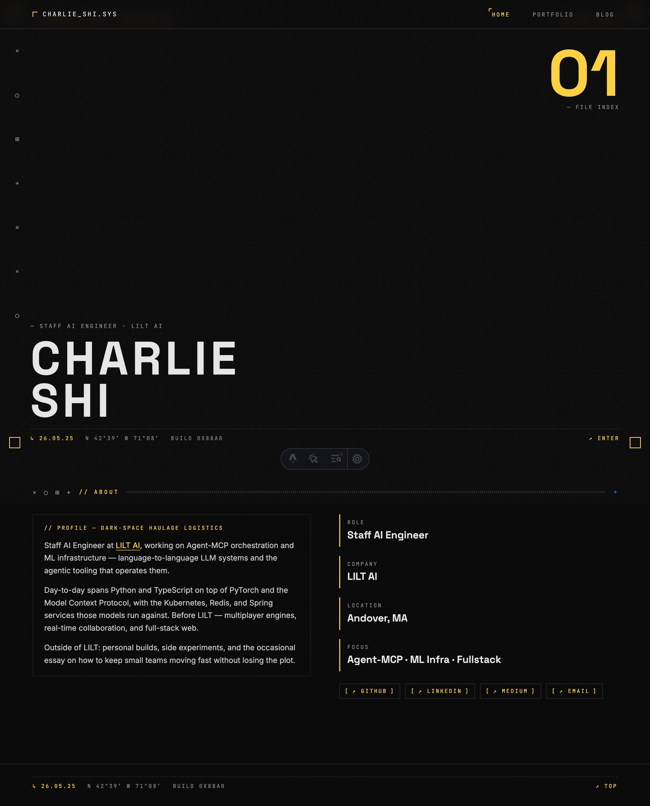
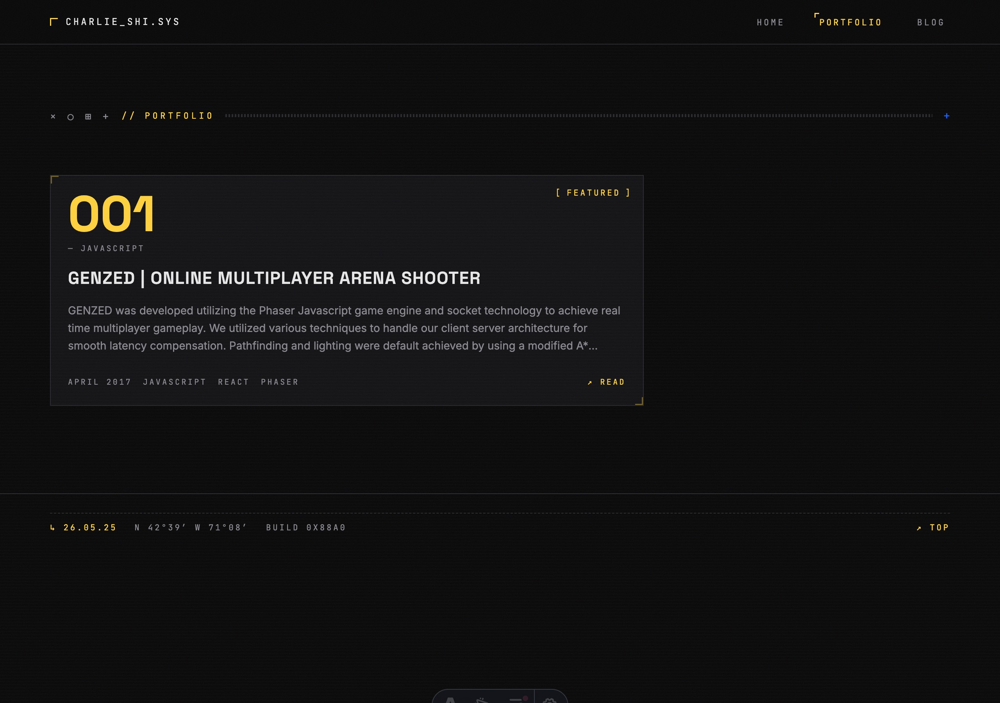
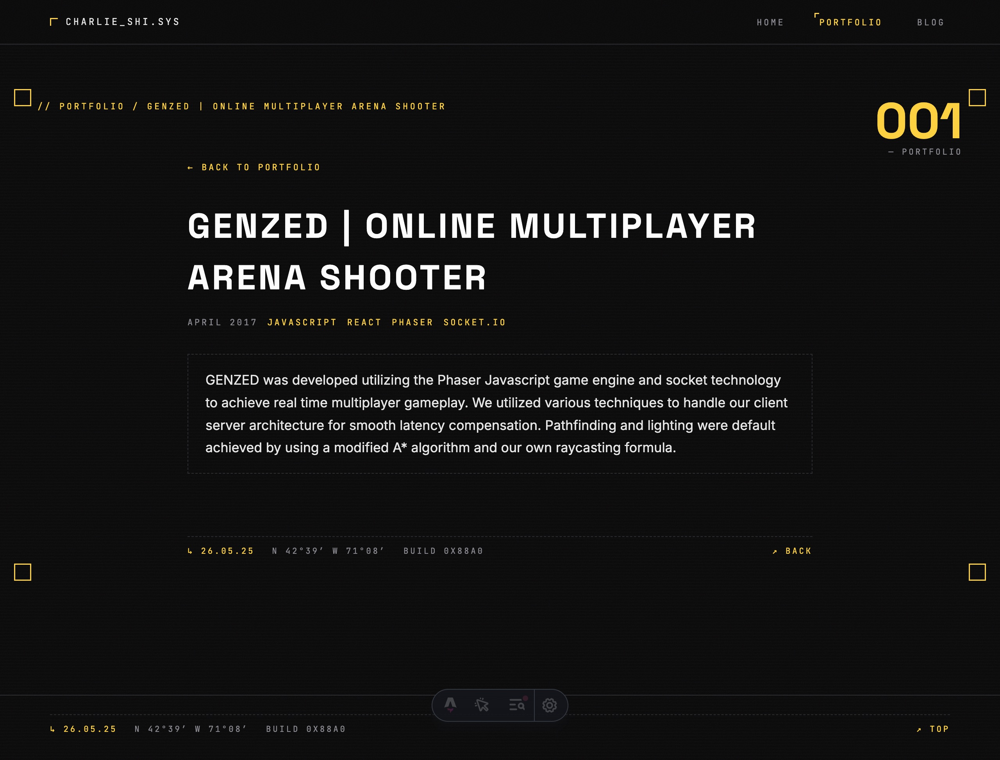
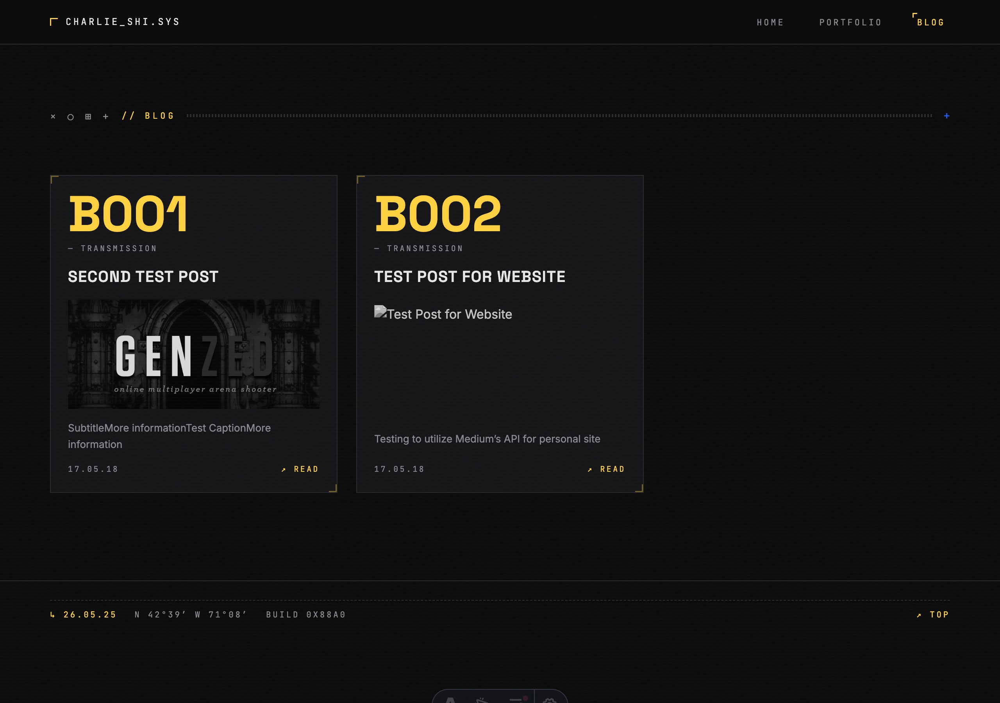
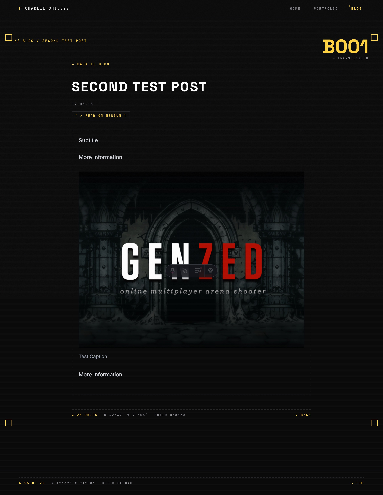

# Antireal Redesign — Handoff Context

**Date completed:** 2026-05-25
**Branch:** master (committed directly, 19 commits in range `e97c1af..HEAD`)
**Status:** Shipped. Build clean. All 5 routes verified visually.

This doc exists so a fresh Claude Code conversation can pick up where the original brainstorm/plan/execute cycle left off, without re-relitigating decisions.

## 1. What was done

Re-skinned the personal portfolio site in the antireal/Marathon visual lineage:
- New palette (yellow + electric blue as the only accents, dropped cyan + magenta).
- New "asymmetric manifest" hero composition.
- New motif library (5 Astro components + 8 CSS utilities).
- Full-site rollout: nav, dividers, cards, about, portfolio + blog listings and detail pages.
- Swept all deprecated CSS (`.dot-grid`, `.glitch-hover`, `.glow-pulse`, old `.scan-lines`, `.reg-mark`) and tokens (`accent-cyan`, `accent-magenta`).
- Updated `CLAUDE.md`.

## 2. Authoritative documents

- **Design spec:** `docs/superpowers/specs/2026-05-25-antireal-redesign-design.md`
- **Implementation plan:** `docs/superpowers/plans/2026-05-25-antireal-redesign.md`
- **Project guide:** `CLAUDE.md` (updated)

The spec defines the design language; the plan is the 15-task execution playbook. Both are checked in.

## 3. Locked decisions (don't relitigate)

| Decision | Value |
|---|---|
| Palette | Dark Terminal — `#0a0a0a` ground, `#ffd23f` primary accent, `#1860ff` reserved for registration marks + hairlines |
| Hero composition | H2 — Asymmetric Manifest (corner brackets, top labels, big yellow `01` file index, vertical glyph strip on left, name bottom-left, dashed meta rail at bottom) |
| Hero copy | Kicker: `— STAFF AI ENGINEER · LILT AI`. Name: `CHARLIE SHI` (EN) ↔ `石千里` (ZH) flicker. Coords: `N 42°39′ W 71°08′` (Andover, MA). |
| Scope | Full site — every route gets the antireal frame |
| Cleanup posture | Replace — deprecated CSS deleted, not commented out |
| Client JS | Zero — every effect is CSS only |
| Light mode | Not in scope |

If you want to revisit one of these in a new iteration, treat it as a deliberate redirection, not a continuation.

## 4. Motif vocabulary (shipped, reusable)

### Astro components (`src/components/`)
| Component | Purpose |
|---|---|
| `CornerFrame.astro` | 4 yellow corner brackets wrapping a slot. Props: `inset`, `color` |
| `MetaBar.astro` | Dashed-top metadata rail. Props: `date`, `coords?`, `build?`, `cta?`, `ctaHref?` |
| `FileIndex.astro` | Big yellow display number. Props: `index`, `label?`, `size?: 'sm'\|'md'\|'lg'` |
| `RegMark.astro` | Blue `+` registration crosshair. Props: `size?` |
| `GlyphStrip.astro` | Vertical or horizontal column of `× ○ ⊞ + ✕`. Props: `direction`, `count?`, `gap?` |

### CSS utilities (`src/styles/global.css`)
- `.glyph-grid` — denser registration grid background (white @ 18px + yellow @ 54px)
- `.dashed-enclosure` — dashed-border container for prose
- `.callout-tag` — `[ LABEL ]` bracketed inline tag
- `.scan-line-soft` — softened scan-line texture (3px stride, 1.2% opacity)
- `.hairline-yellow`, `.hairline-blue` — 1px decorative rules (caller must set width)
- `.dither-divider`, `.section-label`, `.noise-overlay`, `.name-flicker` — kept from prior design

### Build-time meta
`src/lib/buildMeta.ts` — module-load-frozen snapshot exposing `{ date: 'YY.MM.DD', hash: '0xABCD', coords: 'N 42°39′ W 71°08′' }`. Used by every `<MetaBar>`.

## 5. Current state — screenshots

All taken at 1280×900 viewport against the production build.

### Home (`/`)


### Portfolio listing (`/portfolio/`)


### Portfolio detail (`/portfolio/genzed/`)


### Blog listing (`/blog/`)


### Blog detail (`/blog/second-test-post/`)


## 6. Commits in this rollout

```
0dd48a4 fix(design): drop double scan-line-soft on hero (body already supplies it)
4e94723 docs: scrub stale antireal references in CLAUDE.md tree comments
faa1e4c docs: update CLAUDE.md design language for antireal redesign
6ab95ef chore(design): remove deprecated CSS and unused tokens
9c88510 feat(design): apply antireal chrome to blog detail pages + prose color overrides
43592df feat(design): apply antireal chrome to portfolio detail pages
e3cc63c feat(design): add global scan-line-soft and page-foot meta bar
458465a feat(design): rewrite blog card with B-prefixed file index
cc0c2f6 fix(design): remove dead display:block in portfolio card
40e0eea feat(design): rewrite portfolio card with file index + corner ticks
21c4af7 feat(design): rewrite about section with dashed enclosure + stat strips
770741b feat(design): rewrite section divider with glyph strip + index counter
3afff2c feat(design): rewrite navbar with file-system brand and corner-tick active state
f8fbdbd fix(design): make hero corners fill viewport + match ZH bounding box
1efd78c feat(design): rewrite hero as H2 asymmetric manifest
eb24121 feat(design): add antireal motif components
35d6fc1 feat(design): add antireal css utilities
0e6ca0f fix(design): make build-meta deterministic and preserve deprecated tokens during migration
c4b2a5a feat(design): add build-meta utility and antireal tokens
```

## 7. Known latent items (not blockers, worth a polish pass)

- **`.hairline-yellow` / `.hairline-blue` have no `width`** — currently unused by any consumer; if you add one, set `width` inline or update the utility to default to `width: 100%`.
- **`.callout-tag::before/::after` redundantly set `color`** — they inherit from `.callout-tag` already. Cosmetic only.
- **BlogCard thumbnail conditional uses truthy URL check** — if a Medium post returns a thumbnail URL that doesn't resolve at runtime, the alt-text placeholder shows. Pre-existing behavior.
- **Two meta bars on detail pages** — one in-page (with `↗ BACK`), one global page-foot (with `↗ TOP`). This is intentional per spec but worth re-evaluating if it feels noisy.
- **Featured card spans `md:col-span-2`** — works on the home grid (3-col), but the portfolio listing grid uses `auto-fill,minmax(350px,1fr)` so the span behavior depends on viewport width. Currently looks fine; revisit if you add more featured projects.
- **Mobile** — the design was desktop-first. Each rewritten component has a `@media (max-width: 768px)` block, but the small-screen experience hasn't been rigorously verified.

## 8. Suggested next iterations

Ranked by what feels like the highest-leverage next move:

1. **Hero polish at scale** — the `01` file index is currently a static string. Either rotate it as you add sections, or make it a "year" indicator (`26`), or remove it entirely if it reads decorative.
2. **Featured card layout** — only `genzed` is currently featured. Decide whether the antireal language wants 1 hero project per page, or multiple featured cards, or no featured concept at all.
3. **More real portfolio entries** — the site currently has 1 portfolio entry. Adding 3–5 more will expose any cards-grid issues that the single-entry case hides.
4. **Mobile audit** — open each route at 375×667 (iPhone SE) and 414×896 (iPhone Plus). The glyph strip already hides at <768px; check the corner brackets, file index, and stat strips.
5. **Detail-page chrome density** — the corner-framed `<article>` + dashed-enclosure prose + in-page MetaBar + page-foot MetaBar may be too much chrome for short Medium posts. Consider tightening when post content is < N words.
6. **404 / error states** — currently default Astro 404. An antireal-flavored 404 with `// SECTOR NOT FOUND` would feel right.
7. **OG image** — currently no per-page Open Graph image. The antireal style is highly visual; generating per-route OG images would give the site a strong shareable identity.
8. **Animation pass** — everything is currently static or CSS-keyframed. A subtle scroll-driven glyph-strip drift (using CSS `animation-timeline: scroll()` already gated with `@supports`) would give the page a sense of life without shipping JS.
9. **Code blocks in blog prose** — Tailwind `prose-invert` styles them but they don't share the antireal vocabulary. A monospace box with a top-left corner tick and language label would tie them in.
10. **Light-mode variant** — explicitly out of scope for v1, but if anyone ever wants it, the token system is set up cleanly enough to support a `@media (prefers-color-scheme: light)` override.

## 9. How to run / verify

```bash
npm run dev      # http://localhost:4321
npm run build    # produces dist/, fetches Medium RSS
npm run preview  # serves built dist/
```

Verification spot-greps (should all return zero hits in `src/`):

```bash
rg "dot-grid|glitch-hover|glow-pulse|accent-cyan|accent-magenta|scan-lines\b" src/
```

## 10. File inventory (changes in this rollout)

**New files:**
- `src/lib/buildMeta.ts`
- `src/components/CornerFrame.astro`
- `src/components/MetaBar.astro`
- `src/components/FileIndex.astro`
- `src/components/RegMark.astro`
- `src/components/GlyphStrip.astro`
- `docs/superpowers/specs/2026-05-25-antireal-redesign-design.md`
- `docs/superpowers/plans/2026-05-25-antireal-redesign.md`
- `docs/antireal-redesign/context.md` (this file)
- `docs/antireal-redesign/screenshots/*.jpg`

**Modified files:**
- `tailwind.config.mjs` — new accent-blue token, dropped magenta + cyan, refreshed surface/text values, prose-invert color overrides
- `src/styles/global.css` — added antireal utility classes, removed deprecated rules, added H2 name-flicker variant
- `src/components/Hero.astro` — full rewrite to H2 layout
- `src/components/Navbar.astro` — full rewrite
- `src/components/SectionDivider.astro` — full rewrite
- `src/components/AboutSection.astro` — full rewrite
- `src/components/PortfolioCard.astro` — full rewrite
- `src/components/BlogCard.astro` — full rewrite
- `src/layouts/Base.astro` — global scan-line-soft + global page-foot MetaBar
- `src/pages/portfolio/index.astro` — pass `index` to PortfolioCard
- `src/pages/portfolio/[slug].astro` — antireal chrome
- `src/pages/blog/index.astro` — pass `index` to BlogCard
- `src/pages/blog/[slug].astro` — antireal chrome
- `CLAUDE.md` — updated design language section

## 11. To pick this up in a new conversation

Open Claude Code in this repo and paste:

> Read `docs/antireal-redesign/context.md` for the recent redesign context. I want to iterate further — [your specific direction].
